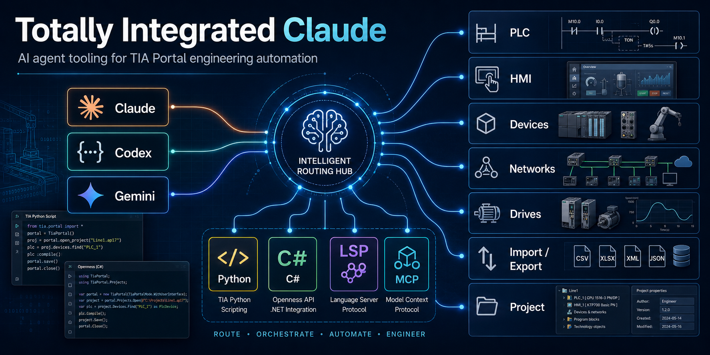

# totally-integrated-claude

An agent plugin for **Siemens TIA Portal engineering automation**, compatible with Claude Code, Codex, and GitHub Copilot in VS Code and Copilot CLI.

Provides a routed skill framework for TIA Portal engineering automation: Siemens TIA Scripting Python V1.4.3 for its supported wrapper surface, audited C# Openness skills for advanced object-model work, and a dedicated Modular Application Creator path.



---

## Features

- **Scoped automation routing** - `tia-openness-roadmap` honors an explicit implementation choice, then selects Python, C#, MAC Module Builder, diagnostic, or Add-In skills
- **Python TIA Scripting V1.4.3** - Siemens wrapper coverage for PLC data, generic HMI access, devices, libraries, and project workflows via `tia-python`
- **C# Openness** - eleven domain skills covering the V21 Openness domain assemblies (see table below)
- **Modular Application Creator** - `tia-mac-module-builder` covers the audited MAC V21.0.5 lifecycle, generated/custom ownership, resources, packaging, and qualification boundaries
- **TIA Portal Add-In development** — VS Code–based Add-In authoring workflow
- **Environment diagnostics** - `tia-doctor` verifies the exact V21 executable, modular Openness core, and user group, with an optional Python check
- **Certified V21 API baselines** - hosted CI validates committed installed-API evidence without requiring TIA Portal on the runner

---

## Skills

| Skill | Purpose |
| --- | --- |
| `tia-openness-roadmap` | **Automation entry point.** Honors explicit scope/path constraints and routes engineering tasks. Pure exported-code review uses `plc-code-analysis` directly. |
| `tia-doctor` | **Manual diagnostic.** Read-only V21 executable/modular API/group probe, with an optional Python check. |
| `plc-code-analysis` | **Standalone.** Evidence-gated PLC security/quality analysis for raw SCL/ST, V21 SIMATIC SD, or schema-valid SimaticML. |
| `tia-python` | Siemens TIA Scripting Python V1.4.3: wrapper-level PLC, HMI, device, library, project, CAx, CFC, project-text, master-copy, and Test Suite workflows. |
| `tia-csharp-common` | C# foundation: TIA Portal process attach, `ExclusiveAccess`, `Transaction`, disposable patterns. Required first load for every C# task. |
| `tia-project-general` | C# project, portal, and library lifecycle: open/create/save/archive/retrieve, project/global libraries, master copies, type/version workflows, UMAC/UMC, language settings, diagnostics. |
| `tia-devices-general` | C# device & device-item operations: hardware catalog, device creation/deletion, slot/subslot traversal, software containers, network connections, hardware parameters. |
| `tia-plc-operations` | C# PLC software engineering: program/system blocks, PLC tags/UDTs, software units, Safety, alarms, OPC-UA, technological objects, watch/force tables, online/download, compare. |
| `tia-hmi-operations` | C# HMI Classic and Unified: separate object models for targets/software, screens/items, tags, alarms, scripts, connections, logging, runtime settings, and compile/import/export. |
| `tia-networks` | C# topology: subnets, nodes, IO systems, port channels, addresses, IO timing. |
| `tia-simatic-drives` | C# Startdrive / SINAMICS: drive controller access, drive engineering, motion control, download. |
| `tia-import-export` | C# & Python import/export: SimaticML, AML/CAx, PLC blocks, HMI screens/tags/alarms, hardware AML, project data. |
| `tia-multiuser` | C# Multiuser Engineering: project-server connections, server-project identity, local/exclusive sessions, marking, locking, save/discard/commit. |
| `tia-teamcenter` | C# provider-based Teamcenter Gateway: connection, search/download, dataset locking, and project/global-library save workflows. |
| `tia-testsuite` | C# TestSuite & Application Test: test sets, application tests, style-guide rules, automated system testing. |
| `tia-sivarc` | C# SiVArc: rule tables and libraries, definitions, expression resolution, layout exchange, and guarded visualization generation. |
| `tia-mac-module-builder` | Modular Application Creator and Module Builder: `TiaEquipmentModule` lifecycle, models/use cases, `.tiares`, generated/custom ownership, packaging, and qualification. |
| `addin-operations` | TIA Portal Add-In development: project structure, VS Code workflow, Add-In lifecycle, menus, permissions, deployment. |

---

## Prerequisites

### Bundled MCP server

The plugin registers [Siemens Docs MCP](https://github.com/Czarnak/siemens-docs-mcp) (`siemens-docs`) for live search and reading of `docs.tia.siemens.cloud`. It starts via `uvx siemens-docs-mcp`, so [uv](https://docs.astral.sh/uv/) must be on `PATH` (it fetches Python 3.11+ as needed).

### For Python TIA Scripting

- TIA Scripting Python V1.4.3 downloaded from Siemens Industry Online Support
- Python 3.12.x, 3.13.x, or 3.14.x with the matching Windows x64 wheel
- TIA Portal and Openness V15.1 or later according to the V1.4.3 manual; Siemens package metadata separately lists V18-V21, so verify the exact installed target

### For C# Openness

- Siemens TIA Portal V21 for these audited API references
- V21 modular Openness API, including `Siemens.Engineering.Base.dll` under `PublicAPI\V21\net48`
- .NET Framework 4.8 or later

### For Modular Application Creator

- Siemens Modular Application Creator and Module Builder matching the target project; the audited skill baseline is MAC V21.0.5
- TIA Portal V21 and its matching Openness PublicAPI for the audited baseline
- .NET Framework 4.8 and access to the project's approved MAC/Module Builder package source

### For Add-In development

- Visual Studio 2022 or VS Code with C# Dev Kit
- TIA Portal Add-In SDK (available from Siemens Industry Online Support)

TIA Scripting Python is not installed from PyPI by package name. Download the
TIA Scripting Python ZIP from Siemens, then use one of Siemens' supported setup
paths:

- File import: unzip it and set `TIA_SCRIPTING` to the directory containing
  `siemens_tia_scripting.pyd` and the supplied adapter DLLs.
- Wheel install: from the extracted package's `install` directory, install the
  V1.4.3 wheel whose CPython tag matches the interpreter, for example:

```powershell
cd C:\Path\To\Your\TIA_Scripting_Python\install
py -3.12 -m pip install .\siemens_tia_scripting-1.4.3-cp312-cp312-win_amd64.whl
```

To check a local machine, run the bundled doctor probe:

```powershell
powershell.exe -NoProfile -ExecutionPolicy Bypass -File skills\tia-doctor\probe.ps1 -RequiredMajorVersion 21
```

For machine-readable output:

```powershell
powershell.exe -NoProfile -ExecutionPolicy Bypass -File skills\tia-doctor\probe.ps1 -RequiredMajorVersion 21 -Json
```

For a C#-only V21 check while Python is intentionally out of scope:

```powershell
powershell.exe -NoProfile -ExecutionPolicy Bypass -File skills\tia-doctor\probe.ps1 -RequiredMajorVersion 21 -SkipPython
```

---

## Installation

Install from GitHub or clone this repository and link it locally while developing.

### Claude Code

```bash
/plugin marketplace add Czarnak/totally-integrated-claude
```

### Codex

Install the marketplace from GitHub:

```bash
codex plugin marketplace add Czarnak/totally-integrated-claude
```

From inside an interactive Codex session, you can use the slash-command form:

```bash
/plugin marketplace add Czarnak/totally-integrated-claude
```


### VS Code And GitHub Copilot

1. Enable agent plugins in VS Code with `chat.plugins.enabled` set to `true`.
2. Run **Chat: Install Plugin From Source** from the Command Palette.
3. Enter `https://github.com/Czarnak/totally-integrated-claude` and review the trust prompt before installing.
4. Check **Chat: Configure Skills** for `tia-openness-roadmap` and **MCP: List Servers** for `siemens-docs`.

For a local checkout, add its absolute path to your VS Code user settings instead
of installing the remote copy. For example, if cloned to `C:\src\totally-integrated-claude`:

```json
{
  "chat.plugins.enabled": true,
  "chat.pluginLocations": {
    "C:/src/totally-integrated-claude": true
  }
}
```

Alternatively, add `Czarnak/totally-integrated-claude` to
`chat.plugins.marketplaces`, then find and install the plugin in the Extensions
view with the `@agentPlugins` filter. The existing Claude marketplace is also
recognized by VS Code and Copilot CLI.

### GitHub Copilot CLI

```bash
copilot plugin install Czarnak/totally-integrated-claude
```

To install a local checkout, run `copilot plugin install .` from its root.
VS Code also discovers plugins installed by Copilot CLI.

The root `plugin.json` and `mcp.json` use the
[Agent Plugins 1.0 format](https://code.visualstudio.com/docs/agent-customization/agent-plugins).
All clients share the same `skills/` content. Claude Code and Codex retain their
client-specific manifests and `.mcp.json`; no skills need to be copied. The plugin
bundles the Siemens documentation server, not a live TIA Portal connection.


---

## Usage

Start TIA Portal automation tasks by asking your agent to load `tia-openness-roadmap`.
For review of supplied or exported PLC code, use `plc-code-analysis` directly.

```text
How do I read all PLC tag tables from an open TIA Portal project?
```

The agent will load `tia-openness-roadmap`, select the correct implementation path (Python, C#, MAC Module Builder, diagnostic, or Add-In), and load the matching focused skill automatically.

### Environment diagnostics

Use `tia-doctor` when TIA Portal automation fails because of missing local
prerequisites. It is a read-only PowerShell probe that checks the exact V21 Portal
executable, `Siemens.Engineering.Base.dll` and installed modular API metadata, and
membership in the `Siemens TIA Openness` Windows user group. The Python TIA
Scripting check is optional and can be skipped with `-SkipPython`.

### Routing examples

| Task | Path | Domain skill |
| --- | --- | --- |
| Analyze raw SCL/ST, SIMATIC SD, or SimaticML for security issues | Standalone | `plc-code-analysis` |
| Read/write PLC blocks and tags | Python | `tia-python` |
| HMI screen access and export | Python | `tia-python` |
| Device slot/subslot manipulation | C# | `tia-devices-general` |
| Subnet and IO-system configuration | C# | `tia-networks` |
| SINAMICS drive engineering | C# | `tia-simatic-drives` |
| Advanced PLC online/security services | C# | `tia-plc-operations` |
| Multiuser Engineering (server projects) | C# | `tia-multiuser` |
| Teamcenter managed projects | C# | `tia-teamcenter` |
| Automated PLC/HMI testing | C# | `tia-testsuite` |
| SiVArc rules or visualization generation | C# | `tia-sivarc` |
| Modular Application Creator module or `.tiares` work | MAC Module Builder | `tia-mac-module-builder` |
| TIA Portal Add-In project | C# | `addin-operations` |

---

## Worth installing to boost your workflow

- C# LSP plugin from [Claude Plugins Official](https://github.com/anthropics/claude-plugins-official)
- [Tia Portal MCP Server](https://github.com/Czarnak/tia-portal-mcp)

## Contributing

See [CONTRIBUTING.md](CONTRIBUTING.md) for contributor setup, validation
commands, test expectations, skill authoring rules, and safety requirements.
Maintainers certifying a new Openness API surface should also follow the
[V21 API baseline workflow](api-baselines/README.md).

## Sources

- [TIA Portal Openness docs](https://docs.tia.siemens.cloud/r/en-us/v21/tia-portal-openness-api-for-automation-of-engineering-workflows/)
- [TIA Scripting Python](https://support.industry.siemens.com/cs/document/109742322/tool-for-easier-use-of-the-tia-portal-openness-interface-(tia-scripting-python))

## Examples

- [PLC Block Scanner](https://github.com/Czarnak/plc-block-scanner) - as simple as possible, strictly as an example.
- [TIA Git Add-In](https://github.com/Czarnak/tia-git-addin) - Add-In for TIA Portal V21 making version control comfortable for PLC engineers.

## License

MIT — see [LICENSE](LICENSE).
